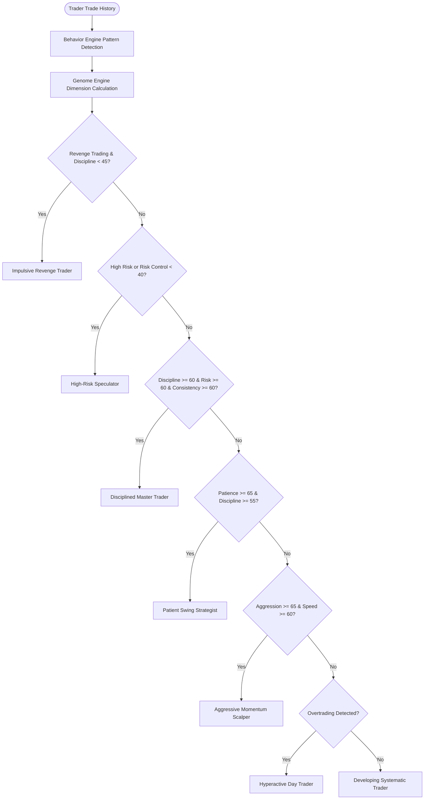

# Trader Genome Behavioral Specification

## 1. Concept & Purpose

The **Trader Genome** is Tradenza's proprietary 9-dimensional behavioral framework designed to quantify a trader's psychological strengths, biases, and execution habits. Rather than evaluating a trader purely by short-term P&L (which can be distorted by luck or market regimes), the Trader Genome evaluates the underlying **process quality**.

---

## 2. The 9 Core Dimensions

Each dimension is scored on a normalized scale from **0.0 to 100.0** (with a default baseline of 50.0):

| Dimension | Description | Key Drivers / Factors |
|---|---|---|
| **Discipline** | Ability to follow trading rules, pre-defined setups, and avoid emotional impulsive actions. | Penalized by revenge trading (-15), overtrading (-10), high risk (-10), early exits (-8), weekend trading (-5). Boosted by positive R:R trades (+15 max). |
| **Patience** | Willingness to wait for valid setups and let profitable trades reach planned profit targets. | Penalized by premature exits (-12), overtrading (-15), holding losing trades longer than winners (-10). Boosted by longer hold times on valid setups. |
| **Consistency** | Uniformity of position sizing, strategy execution, and risk allocation across trades. | Measured by the Coefficient of Variation ($CV = \frac{\sigma}{\mu}$) of position sizing. $CV < 0.2 \implies +15$, $CV < 0.5 \implies +5$, $CV \ge 0.5 \implies -10$. |
| **Aggression** | Propensity to take high risk, trade high frequency, or scale into losing setups. | Increased by revenge trades (+10), overtrading (+15), high risk sizing (+10). |
| **Risk Control** | Adherence to capital preservation, stop-loss discipline, and favorable Risk-to-Reward. | Penalized severely by high risk sizing (-20), revenge trading (-10), and holding loss asymmetry (-10). Boosted by trades having $R:R \ge 1.5$ (+20 max). |
| **Decision Speed** | Execution latency and holding duration characteristics. | Scalpers holding $< 15$ mins get boosted speed (+10). Swing trades $> 240$ mins reduce speed (-5) and boost patience (+10). |
| **Adaptability** | Ability to adjust behavior when market conditions change or when biases are identified. | Evaluated by comparing the number of active behavioral biases across evaluation cycles. |
| **Confidence** | Alignment between self-reported conviction and actual trade expectancy. | Weighted combination of user-reported pre-trade confidence and actual win-rate ($0.5 \times \text{reported} + 0.5 \times \text{win\_rate}$). |
| **Learning Rate** | Speed of pattern elimination over time. | Boosted (+15) when detected negative behavioral patterns decrease relative to previous evaluation cycles. |

---

## 3. Mathematical Formulation & Weighting

### A. Clamping
All dimensions are clamped between 0.0 and 100.0:
$$\text{Dimension} = \max(0.0, \min(100.0, \text{Score}))$$

### B. Composite Overall Genome Index
The composite `overall_score` represents the holistic execution quality and is calculated via a weighted linear combination:

$$\text{Overall Score} = (0.25 \times \text{Discipline}) + (0.20 \times \text{Risk Control}) + (0.15 \times \text{Patience}) + (0.15 \times \text{Consistency}) + (0.10 \times \text{Adaptability}) + (0.05 \times \text{Confidence}) + (0.05 \times \text{Learning Rate}) + (0.05 \times \text{Decision Speed})$$

Notice that **Discipline** ($25\%$) and **Risk Control** ($20\%$) comprise nearly half the total score, reflecting Tradenza's principle of **Capital Protection First**.

---

## 4. Trader Archetypes

The `GenomeEngine` categorizes traders into distinct archetypes based on their dimensional profile and detected patterns:

### Archetype Descriptions:
1. **Disciplined Master Trader**: Demonstrates high discipline ($\ge 60$), strong risk control ($\ge 60$), and consistent execution. Protects capital and adheres to rules.
2. **Patient Swing Strategist**: Displays exceptional patience ($\ge 65$), letting winning positions develop toward full targets with structured discipline.
3. **Aggressive Momentum Scalper**: Rapid decision speeds and elevated aggression scores, taking fast-paced intraday setups.
4. **Impulsive Revenge Trader**: Exhibits lapses in discipline after losses, entering quick reactive trades with elevated position size.
5. **High-Risk Speculator**: Disregards position sizing limits or trades with unfavorable Risk-to-Reward ratios ($< 1:1$).
6. **Hyperactive Day Trader**: Trades excessively beyond strategic setup parameters, leading to fee degradation and fatigue.
7. **Developing Systematic Trader**: Baseline profile actively learning, building trade history, and calibrating execution habits.
