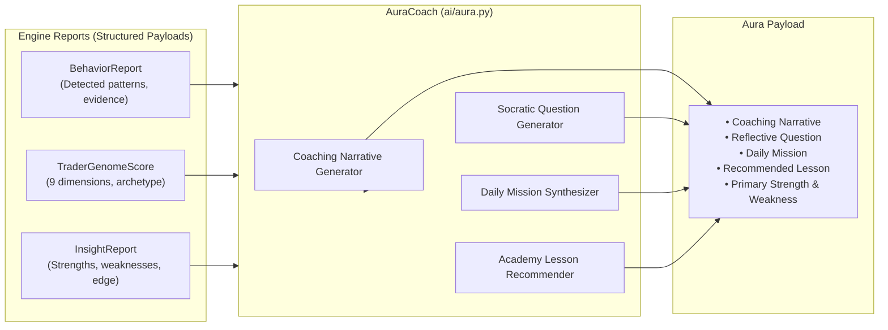

# Aura AI Architecture & Coaching Specification

## 1. System Role & Philosophy

**Aura** is Tradenza's intelligent coaching and explanatory AI layer. Rather than operating as an unconstrained generative chatbot that might provide arbitrary financial forecasts or hallucinatory advice, Aura operates on a strict **Grounded Interpretation Principle**:

> **"Aura explains evidence; it never invents facts."**

Every statement, question, and daily mission emitted by Aura is directly traceable to mathematically computed findings from the **Behavior Engine**, **Genome Engine**, and **Insight Engine**.

---

## 2. Core Functional Components (`ai/aura.py`)

### A. Contextual Coaching Narrative (`_build_coaching_narrative`)
Constructs an executive briefing customized to the trader's recent session:
- Salutes the trader by name.
- Summarizes the active **Trader Archetype** and composite **Genome Index**.
- Highlights the primary data observation (e.g., peak performance session or expectancy metric).
- Lists flagged behavioral anomalies or acknowledges clean execution.

### B. Socratic Reflective Questions (`_generate_reflective_question`)
Aura avoids finger-pointing criticism; instead, it uses Socratic inquiry to guide the trader toward self-reflection:
- *On Revenge Trading*: "Looking back at the trade entered shortly after your loss, what emotion was driving your revenge entry: a valid setup or the desire to get your money back?"
- *On Early Exits*: "When you closed your winning trade early, was there a clear technical exit signal on the chart, or did fear of losing profit take over?"
- *On Overtrading*: "What triggered you to keep opening trades after your standard daily limit was reached?"
- *On Clean Sessions*: "Looking back at your recent winning trades, what setup criteria contributed most to your clean execution?"

### C. Daily Behavioral Missions (`_suggest_daily_mission`)
Provides a single, focused, actionable commitment for the trader's next market session:
- *Revenge Trading*: "Take a mandatory 20-minute break away from charts after any losing trade today."
- *Overtrading*: "Limit yourself to a maximum of 3 high-conviction trades today."
- *Early Exits*: "Let at least one trade reach its full planned target without manual intervention."
- *High Risk*: "Keep your risk on every trade under 2.0% of account capital."
- *Default*: "Follow your pre-trade checklist for 100% of entries today."

### D. Academy Lesson Recommender (`_recommend_lesson`)
Maps identified weaknesses directly to educational modules in `ACADEMY.md`:
- Discipline weaknesses $\to$ `lesson_emotions_and_revenge_trading`
- Patience weaknesses $\to$ `lesson_holding_winners_to_target`
- Risk Control weaknesses $\to$ `lesson_position_sizing_mastery`
- Baseline $\to$ `lesson_introduction_to_trader_psychology`

---

## 3. Integration Points

1. **`AnalyticsService.refresh_user()`**:
   - Executes `AuraCoach.explain_session()` as the final step of the central intelligence pipeline.
   - Attaches the resulting payload to the dictionary returned to controllers.
2. **Dashboard View (`/dashboard`)**:
   - Renders Aura's coaching card with daily guidance and reflection.
3. **Dedicated Coach View (`/coach`)**:
   - Provides an expanded interface for reviewing historical coaching logs and session reflections.
