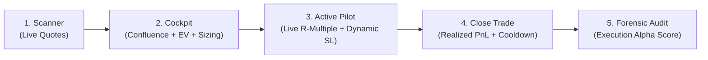

# 📘 Tradenza User Manual & Platform Workflow Guide

Welcome to **Tradenza** — an institutional-grade, AI-assisted trading operating system and behavioral analytics journal designed to help traders make disciplined, mathematically sound, and emotionally resilient trading decisions.

Unlike typical retail journals that only calculate past profit and loss, Tradenza acts as a **10-Year Veteran Analytical Trading Intelligence Layer**. It combines deterministic quantitative calculations, weighted continuous vector similarity ($K$-NN), corporate relationship graphs, and frontier reasoning models (NVIDIA NIM DeepSeek V4.1 Flash, Google Gemini, OpenAI) to guide you through every stage of your trading journey: **before entry**, **during the live trade**, and **after exit**.

---

## 📑 Table of Contents

1. [Quick Start & System Setup](#1-quick-start--system-setup)
2. [Account Setup & Institutional Risk Configuration](#2-account-setup--institutional-risk-configuration)
3. [The End-to-End Trading Lifecycle (Core User Flow)](#3-the-end-to-end-trading-lifecycle-core-user-flow)
   - [Phase 1: Pre-Market Discovery & Watchlist Scanning](#phase-1-pre-market-discovery--watchlist-scanning)
   - [Phase 2: Setup Formulation & Pre-Flight Cockpit](#phase-2-setup-formulation--pre-flight-cockpit)
   - [Phase 3: Active In-Trade Piloting & Telemetry](#phase-3-active-in-trade-piloting--telemetry)
   - [Phase 4: Closing a Trade & Cooldown Firebreak](#phase-4-closing-a-trade--cooldown-firebreak)
   - [Phase 5: Post-Market Forensic Audit & Execution Alpha](#phase-5-post-market-forensic-audit--execution-alpha)
4. [Executive Dashboard & Performance Command Center](#4-executive-dashboard--performance-command-center)
5. [In-Depth Analytics & Interactive Equity Curves](#5-in-depth-analytics--interactive-equity-curves)
6. [Trader Genome & Aura AI Behavioral Coach](#6-trader-genome--aura-ai-behavioral-coach)
7. [Digital Twin Counterfactual Simulator](#7-digital-twin-counterfactual-simulator)
8. [Trade History, Search, & Broker CSV Import/Export](#8-trade-history-search--broker-csv-importexport)
9. [Portfolio Ledger & Cash Management](#9-portfolio-ledger--cash-management)
10. [Institutional Trading Playbook & Academy](#10-institutional-trading-playbook--academy)
11. [Frequently Asked Questions & Troubleshooting](#11-frequently-asked-questions--troubleshooting)

---

## 1. Quick Start & System Setup

### Prerequisites
- Python 3.10+ (Recommended: Python 3.12)
- Virtual environment (`.venv`)
- Modern web browser (Chrome, Edge, Firefox, Brave)

### Launching the Application
Open your terminal in the Tradenza project root directory:

```bash
# 1. Activate the Python virtual environment
source .venv/bin/activate

# 2. Start the Flask application
python app.py
```

The application will start on:
👉 **`http://127.0.0.1:5000`**

### Pre-Configured Test Account
You can log in immediately with the pre-configured test account:
- **URL**: `http://127.0.0.1:5000/login`
- **Email**: `atul@gmail.com`
- **Password**: `password123`

Or create a new trader account at `http://127.0.0.1:5000/register`.

---

## 2. Account Setup & Institutional Risk Configuration

Before placing your first trade, calibrate your risk parameters and AI model in the **Settings** menu.

Navigate to **Settings** (`/settings`) from the left sidebar or top navigation.

```
┌────────────────────────────────────────────────────────────────────────┐
│                        TRADENZA RISK GUARDRAILS                        │
├────────────────────────────────────────────────────────────────────────┤
│  Account Currency:        [ ₹ / $ / € / £ ]                            │
│  Starting Balance:        [ 10,000.00 ]                                │
│  Max Risk Per Trade (%):  [ 2.0 % ]   <-- Hard Kelly Sizing Ceiling    │
│  Daily Max Loss Limit:    [ $500.00 ] <-- Emotional Tilt Firebreak     │
├────────────────────────────────────────────────────────────────────────┤
│                        AI INTELLIGENCE SUITE                           │
├────────────────────────────────────────────────────────────────────────┤
│  AI Provider:     [ NVIDIA NIM / Gemini / OpenAI / Ollama Local ]      │
│  AI Model:        [ deepseek-ai/deepseek-v4.1-flash ]                  │
│  NVIDIA API Key:  [ nvapi-******************************** ]           │
│  Coaching Style:  [ Analytical / Disciplined / Socratic / Supportive ] │
└────────────────────────────────────────────────────────────────────────┘
```

### Risk Guardrails Explained
1. **Max Risk Per Trade (%)**: Institutional benchmark is typically **1.0% – 2.0%**. This serves as a hard boundary for Tradenza's **Half-Kelly Position Sizing** engine. No matter how attractive a setup appears, the system will never suggest sizing above this ceiling.
2. **Daily Max Loss Limit**: If your realized daily losses reach this threshold, Tradenza's **TradeBuddy Firebreak** activates, entering a mandatory cooldown state to prevent revenge trading.
3. **AI Intelligence Engine**:
   - **NVIDIA NIM (`deepseek-ai/deepseek-v4.1-flash`)**: Blazing-fast institutional reasoning and devil's advocate red-teaming.
   - **Google Gemini / OpenAI**: Fully supported multi-provider fallback.
   - **Offline Heuristics**: If you don't provide an API key or run without an internet connection, Tradenza automatically uses mathematical rule-based fallback engines.

---

## 3. The End-to-End Trading Lifecycle (Core User Flow)

Tradenza structures every trade across **five disciplined phases**:



---

### Phase 1: Pre-Market Discovery & Watchlist Scanning

**Navigate to**: **Market Scanner** (`/market/scanner`)

1. **Multi-Asset Watchlists**: Scan real-time prices across Indian Equities (`TATAMOTORS`, `RELIANCE`, `INFY`), US Equities (`NVDA`, `AAPL`, `MSFT`, `TSLA`), and Cryptocurrencies (`BTC/USD`, `ETH/USD`).
2. **Key Telemetry**: Check current price, daily percentage change, high/low spread, and volume pace.
3. **One-Click Pre-Fill**: Click the **Trade** button next to any instrument. Tradenza will automatically open the **New Trade Cockpit** with the symbol and latest market price already filled in.

---

### Phase 2: Setup Formulation & Pre-Flight Cockpit

**Navigate to**: **New Trade** (`/trades/new`)

This is where institutional discipline begins. As you enter your trade parameters, the right side of the screen dynamically updates with the **Institutional Pre-Flight Blueprint**:

#### Step 1: Input Setup Parameters
- **Market**: Choose Stocks, Crypto, Forex, Commodities, or Indices.
- **Symbol**: E.g., `TATAMOTORS` or `NVDA`.
- **Direction**: `BUY` (Long) or `SELL` (Short).
- **Strategy**: E.g., Breakout, Pullback, Mean Reversion, Momentum, Reversal.
- **Entry Price**, **Stop Loss**, and **Target Price**: Set your intended technical boundaries.

#### Step 2: Review the Institutional Pre-Flight Blueprint

```
┌────────────────────────────────────────────────────────────────────────┐
│                   INSTITUTIONAL PRE-FLIGHT BLUEPRINT                   │
├────────────────────────────────────────────────────────────────────────┤
│  Confluence Score: [ 85 / 100 ]   Rating: INSTITUTIONAL A-GRADE        │
│  Expected Value:   [ +0.82 R / trade ]  Verdict: HIGH MATHEMATICAL EDGE│
├────────────────────────────────────────────────────────────────────────┤
│  VOLATILITY-ADJUSTED HALF-KELLY SIZING                                 │
│  Recommended Units: 85 shares   |  Risk Allocation: $170.00 (1.70%)    │
│  [ Apply Institutional Size ]  <-- 1-Click Auto Fill Quantity          │
├────────────────────────────────────────────────────────────────────────┤
│  3-TIER TARGET LADDER                                                  │
│  • TP1 (+1.1R): $105.50  --> Take 40% Off & Move SL to Breakeven       │
│  • TP2 (+2.2R): $111.00  --> Core Swing Scale (40%)                    │
│  • TP3 (+3.5R): $117.50  --> Runner Phase (20%) with ATR Trailing Stop │
│  • Invalidation: $94.80  --> Setup premise completely broken           │
├────────────────────────────────────────────────────────────────────────┤
│  DEEPSEEK DEVIL'S ADVOCATE PRE-MORTEM (RED TEAM)                       │
│  "Why this trade will fail: Check if volume is slowing at upper trend  │
│   line. Watch out for high ATR spread and sector lag."                 │
└────────────────────────────────────────────────────────────────────────┘
```

1. **5-Pillar Confluence Score (0–100)**:
   - **Trend Alignment (25 pts)**: EMA20 vs EMA50 regime alignment.
   - **Volume Confirmation (20 pts)**: Verifies whether volume is expanding ($> 1.3\times$).
   - **Volatility Health (15 pts)**: Ensures ATR is in the sweet spot (avoids choppy traps).
   - **Catalyst & Sentiment (15 pts)**: Finnhub news sentiment check.
   - **Asymmetric R:R (25 pts)**: Awards full points if planned Reward:Risk $\ge 2.0$.
2. **Mathematical Expected Value ($EV$)**:
   $$EV = (P_{\text{win}} \times R_{\text{target}}) - ((1 - P_{\text{win}}) \times 1.0) - \text{friction}$$
   If a setup has negative expectancy ($EV \le 0$), Tradenza highlights a red warning: **"Negative Expectancy — DO NOT TRADE"**.
3. **Volatility-Adjusted Half-Kelly Position Sizing**:
   The system calculates the optimal mathematical position size using the Kelly Criterion ($f^* / 2$), adjusts for asset volatility, and respects your risk ceiling. Click **"Apply Institutional Size"** to instantly fill the quantity field.
4. **DeepSeek Devil's Advocate Pre-Mortem**:
   Before you commit hard-earned capital, the AI red-teams your trade, challenging your bias and pointing out potential bull/bear traps.
5. **K-NN Similar Case Retrieval**:
   Displays the historical win rate and median 5-day return of the closest historical setups found in empirical market history.

#### Step 3: Execute & Log
Click **Save Trade**. The trade is created in `OPEN` status, your portfolio metrics update, and your trader genome recalibrates.

---

### Phase 3: Active In-Trade Piloting & Telemetry

**Navigate to**: **Trade Details** (`/trades/<id>`) for any Open Trade.

Once in a position, a retail trader feels anxiety; an institutional trader executes an objective **In-Trade Protocol**. Tradenza equips you with the **Active Trade Pilot HUD**:

```
┌────────────────────────────────────────────────────────────────────────┐
│                        ACTIVE TRADE PILOT HUD                          │
├────────────────────────────────────────────────────────────────────────┤
│  Live R-Multiple: [ +1.45 R ]     Lifecycle: [ DE-RISKING PHASE ]      │
│  Max Favorable Excursion: +1.60 R  |  Current Live Price: $107.25      │
├────────────────────────────────────────────────────────────────────────┤
│  DYNAMIC ACTION DIRECTIVE                                              │
│  "TP1 threshold exceeded (+1.1R reached). Scale out 40% of position    │
│   and immediately shift Stop Loss to Breakeven ($100.20)."             │
├────────────────────────────────────────────────────────────────────────┤
│  [ Consult DeepSeek Trade Pilot ]  <-- Real-time AI tactical orders    │
└────────────────────────────────────────────────────────────────────────┘
```

#### The 5 In-Trade Lifecycle Stages:
1. **Invalidation Danger Zone ($R < -0.6$)**: Setup is under pressure. Prepare for structural stop loss.
2. **Noise Variance ($-0.6 \le R < +0.9$)**: Normal market chop. Directs you to stay patient and avoid micro-managing.
3. **De-Risking Phase ($+0.9 \le R < +1.8$)**: TP1 achieved. Move stop loss to breakeven ($+0.05R$) to create a completely "free trade".
4. **Core Expansion ($+1.8 \le R < +3.0$)**: TP2 achieved. Lock in at least $+1.0R$ in guaranteed profit.
5. **Runner Phase ($R \ge +3.0$)**: TP3 achieved. Maintain remaining 20% position and ratchet trailing stop using dynamic ATR buffers.

#### On-Demand AI Tactical Advice
Click **"Consult DeepSeek Trade Pilot"** at any moment to get real-time tactical advice based on current price action, peak excursion, and dynamic support/resistance.

---

### Phase 4: Closing a Trade & Cooldown Firebreak

**Navigate to**: **Close Trade** (`/trades/<id>/close`)

When you exit your position:
1. Enter your **Exit Price**.
2. Select your **Exit Emotion** (Confident, Neutral, Anxious, Impulsive, Regretful).
3. Select your **Exit Reason** (Target Hit, Stop Loss, Trailing Stop, Manual Exit, News Event).
4. Add final **Exit Notes**.
5. Click **Close Trade**.

#### Automated TradeBuddy Firebreak Protection
If the closed trade resulted in a loss that breaches your daily loss threshold or represents multiple consecutive losses, Tradenza's **TradeBuddy Cooldown** automatically triggers:
- A 30-minute psychological firebreak is initiated.
- The New Trade Cockpit will display an active cooldown alert advising you to step away from the screen to prevent tilt and revenge trading.

---

### Phase 5: Post-Market Forensic Audit & Execution Alpha

**Navigate to**: **Trade Details** (`/trades/<id>`) for any Closed Trade.

A trade that made money can still be a bad trade (bad process, lucky outcome), and a trade that lost money can be a great trade (disciplined risk, bad variance). Tradenza conducts an automated **Forensic AI Post-Mortem Audit**:

```
┌────────────────────────────────────────────────────────────────────────┐
│                   FORENSIC AI POST-MORTEM AUDIT                        │
├────────────────────────────────────────────────────────────────────────┤
│  Execution Alpha Score: [ 92 / 100 ]   Execution Grade: [ A-GRADE ]    │
│  Planned R:R: 2.50  vs  Realized R:R: 2.35  (94.0% Plan Adherence)    │
├────────────────────────────────────────────────────────────────────────┤
│  BEHAVIORAL ROOT CAUSE                                                 │
│  Clean Plan Execution — Patiently held through the noise phase and     │
│  scaled out according to the planned target ladder.                    │
├────────────────────────────────────────────────────────────────────────┤
│  INSTITUTIONAL GOLDEN RULE                                             │
│  "Protect your process over short-term results. When planned R:R is    │
│   consistently realized, long-term positive expectancy is guaranteed." │
└────────────────────────────────────────────────────────────────────────┘
```

- **Execution Alpha Score (0–100)**: Quantifies execution quality independent of market luck.
- **Planned vs Realized R:R**: Detects whether you cut profits prematurely or let losses run beyond your stop.
- **Behavioral Root Cause**: Pinpoints psychological leaks (FOMO, Revenge, Hesitation, Premature Exit).
- **Institutional Golden Rule**: Delivers a concise, actionable takeaway for your future playbook.

---

## 4. Executive Dashboard & Performance Command Center

**Navigate to**: **Dashboard** (`/dashboard`)

The Command Center aggregates your high-level metrics into a single real-time view:
- **Financial KPIs**: Current Portfolio Balance, Net Realized PnL, Total Trades, Win Rate %, Profit Factor.
- **Active Trade Pipeline**: Overview of open positions with current live quotes.
- **Trader Genome Health**: Overall Discipline & Consistency score (0–100).
- **Aura Daily Mission**: Daily focus directive (e.g. *"Wait for candle close before entering breakouts"*).
- **Quick Links**: Jump straight into the Scanner, New Trade entry, or Aura Coach.

---

## 5. In-Depth Analytics & Interactive Equity Curves

**Navigate to**: **Analytics** (`/analytics`)

The Analytics suite breaks down your historical performance across multiple dimensions:

1. **Strategy Performance Breakdown**:
   - Compares Win Rate, Profit Factor, and Net PnL across each strategy (Breakouts vs Pullbacks vs Mean Reversion).
   - Identifies which strategies provide you an edge and which drain your capital.
2. **Market & Asset Class Analysis**:
   - Compare performance across Equities, Crypto, and Forex.
3. **Execution Distribution**:
   - Long vs Short trade profitability.
   - Win/Loss ratio and average hold time.
4. **Equity Curve & Drawdown Visualizer**:
   - Track account growth over time with high-water marks and peak-to-trough drawdown visualization.

---

## 6. Trader Genome & Aura AI Behavioral Coach

**Navigate to**: **AI Coach Aura** (`/coach`)

**Aura** is your personalized behavioral trading coach. Rather than just giving generic market commentary, Aura has full access to your trading database, recent execution leaks, and Trader Genome.

```
┌────────────────────────────────────────────────────────────────────────┐
│                        AURA AI COACHING SUITE                          │
├────────────────────────────────────────────────────────────────────────┤
│  TRADER GENOME ARCHETYPE: "Disciplined Trend Follower"                 │
│  • Risk Discipline: 88/100                                             │
│  • Trade Patience:  82/100                                             │
│  • Emotional Control: 79/100                                           │
├────────────────────────────────────────────────────────────────────────┤
│  TODAY'S REFLECTIVE QUESTION:                                          │
│  "On your last 3 trades, you closed at +1.2R when your target was      │
│   +2.5R. What emotion caused you to exit early before TP2?"            │
├────────────────────────────────────────────────────────────────────────┤
│  INTERACTIVE CHAT INTERFACE                                            │
│  You: "How is my discipline score trending this week?"                 │
│  Aura: "Your discipline score rose by 6 points following your Tata    │
│         Motors trade where you honored your breakeven stop..."         │
└────────────────────────────────────────────────────────────────────────┘
```

### Suggested Prompts to Ask Aura:
- *"What is my biggest behavioral leak this month?"*
- *"Am I honoring my risk parameters on losing days?"*
- *"Which of my strategies has the highest mathematical edge?"*
- *"Help me review my trade execution on AAPL."*

---

## 7. Digital Twin Counterfactual Simulator

**Navigate to**: **Digital Twin** (`/digital-twin`)

The Digital Twin is a counterfactual simulator that models your behavioral patterns and simulates "what-if" scenarios:

- **"What If I Never Cut Winners Early?"**: Re-runs your closed trades assuming you held to the full planned target ladder.
- **"What If I Stopped Trading After 2 Consecutive Losses?"**: Simulates your equity curve with strict loss firebreaks applied.
- **"What If I Followed Half-Kelly Sizing on Every Trade?"**: Demonstrates capital preservation and compound growth under institutional risk controls.

---

## 8. Trade History, Search, & Broker CSV Import/Export

### Trade Journal & Filtering
**Navigate to**: **Trade History** (`/trades/`)

- **Full-Text Search**: Search by ticker symbol, tags, broker, or notes.
- **Multi-Facet Filtering**: Filter by Market (Stocks, Crypto, Forex), Status (Open, Closed), or Direction (Buy, Sell).
- **Paginated Ledger**: Clean, high-density table displaying Entry, Exit, PnL, R:R, and Status.

### Bulk CSV Import & Export
**Navigate to**: **Import Trades** (`/trades/import`)

Tradenza supports bulk importing trade records from major broker CSV exports:
- **Supported Brokers**: Zerodha, Groww, Angel One, Interactive Brokers, Upstox, and standard generic CSV.
- **Auto-Column Mapping**: Automatically maps Date, Symbol, Type, Price, Quantity, and PnL columns.
- **CSV Export**: Click **Export Trades** on the Trade History page (`/trades/export`) to download your entire journal in standard CSV format at any time.

---

## 9. Portfolio Ledger & Cash Management

**Navigate to**: **Portfolio** (`/portfolio`)

Keep your trading account ledger in sync with your real-world broker balance:
- **Cash Deposits & Withdrawals**: Record deposits to update starting capital or log withdrawals when paying yourself trading profits.
- **Realized PnL vs Available Balance**: See exact cash available vs active capital committed to open positions.
- **Equity Snapshot History**: Historical timestamped equity entries showing balance evolution.

---

## 10. Institutional Trading Playbook & Academy

**Navigate to**: **Playbook & Academy** (`/learn`)

The Playbook contains curated institutional trade setups and rules:
1. **High-Probability Breakouts**: Pre-conditions, volume expansion triggers, and invalidation boundaries.
2. **Fibonacci & EMA Pullbacks**: Pullback entries in trending regimes.
3. **Liquidity Sweep Reversals**: Identifying false breakouts and institutional trap entries.
4. **Institutional Execution Rules**:
   - *"Never add to a losing position."*
   - *"A trade that hits +1R must never become a loss (lock breakeven)."*
   - *"Size by volatility (ATR), not by account conviction."*

---

## 11. Frequently Asked Questions & Troubleshooting

### Q1: What happens if my internet disconnects or API keys expire?
**A:** Tradenza is built with **zero external hard dependencies**. All market quotes, confluence scoring, position sizing, and AI trade audits include pure Python rule-based fallback engines. If live data is unreachable, the system automatically uses deterministic offline benchmarks and heuristics without crashing.

### Q2: Why does the system recommend a smaller position size than my balance allows?
**A:** Tradenza uses **Volatility-Adjusted Half-Kelly Sizing**. If an asset has high volatility (ATR $> 4.0\%$) or an uneven risk/reward ratio, the sizing engine deliberately reduces your share count to protect your account against catastrophic drawdowns and gap risk.

### Q3: How do I change my currency symbol from `$` to `₹`?
**A:** Go to **Settings** (`/settings`), change the currency field from `$` to `₹`, and click **Save Preferences**. All dashboard cards, trade tables, and portfolio views will immediately display in Indian Rupees.

### Q4: How do I clear my test trade history and start fresh?
**A:** You can delete individual trades from the **Trade Details** page (`/trades/<id>`), or register a new user account at `/register` with your fresh starting capital.

---

*Trade Less. Think Better. Improve Consistently.*  
**Tradenza — The Operating System for Disciplined Traders.**
