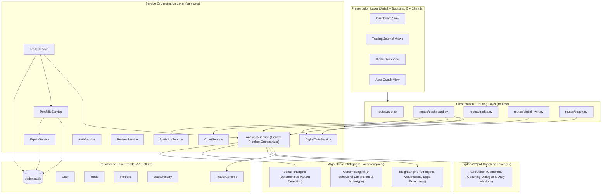

# Tradenza Architecture Specification

## 1. Overview & Architectural Philosophy

Tradenza is an AI-assisted trading journal and behavioral analytics platform. Unlike traditional trading platforms that attempt to predict financial markets, Tradenza is built upon the philosophy:
> **"Behavior Over Prediction — Help traders understand themselves."**

The platform follows **Clean Architecture** and the **Service Layer Pattern** in Flask, ensuring clear separation of concerns between data storage, domain calculations, service orchestration, routing, and user interface.



---

## 2. Layer Breakdown

### A. Core Application Layer (`core/`, `config.py`, `extensions.py`)
- **`core/factory.py`**: Implements the Application Factory pattern (`create_app()`). Configures paths, initializes extensions, and registers Blueprints.
- **`extensions.py`**: Instantiates singleton Flask extensions (`db` = SQLAlchemy, `login_manager` = LoginManager, `migrate` = Migrate).
- **`config.py`**: Manages environment configuration such as `SECRET_KEY` and `SQLALCHEMY_DATABASE_URI`.

### B. Persistence Layer (`models/`)
Contains SQLAlchemy ORM models representing the core domain:
- **`User`**: Account identity and credential storage, with relationships to `Trade`, `Portfolio`, and `TraderGenome`.
- **`Trade`**: Detailed trade logs including market, symbol, side (BUY/SELL), entry/exit prices, stop-loss, target, emotions, and P&L.
- **`Portfolio`**: User account metrics, balance, total deposits/withdrawals, realized profit, and win rate.
- **`EquityHistory`**: Daily historical equity and balance snapshots for charting equity curves.
- **`TraderGenome`**: Persisted behavioral scores across the 9 dimensions and classified archetype.

### C. Algorithmic Intelligence Engines (`engines/`)
Pure Python, deterministic calculation engines decoupled from web frameworks:
1. **`BehaviorEngine`**:
   - Detects negative psychological patterns without hallucination.
   - Patterns: `revenge_trading`, `early_exit`, `overtrading`, `high_risk`, `holding_time_asymmetry`, and `weekend_trading`.
   - Computes a deterministic `discipline_score_delta`.
2. **`GenomeEngine`**:
   - Computes 9 behavioral dimensions scored between 0 and 100:
     - Discipline, Patience, Consistency, Aggression, Risk Control, Decision Speed, Adaptability, Confidence, Learning Rate.
   - Calculates the weighted `overall_score`.
   - Classifies the trader's behavioral archetype (e.g., *Disciplined Master Trader*, *High-Risk Speculator*, *Impulsive Revenge Trader*).
3. **`InsightEngine`**:
   - Analyzes day-of-week biases, risk-to-reward edge expectancy, and flags high-leverage strengths and weaknesses.

### D. Explanatory AI Coaching Layer (`ai/`)
- **`AuraCoach` (`ai/aura.py`)**:
  - Consumes structured reports from `BehaviorEngine`, `GenomeEngine`, and `InsightEngine`.
  - Translates data into supportive, evidence-grounded coaching narratives.
  - Formulates personalized reflective questions and action-oriented daily missions.
  - Zero hallucination guarantee: Aura only references verified events generated by the engines.

### E. Service Orchestration Layer (`services/`)
Encapsulates business operations away from HTTP controllers:
- **`AnalyticsService`**: Central intelligence coordinator. Fetches trades, drives the pipeline (`Behavior` → `Genome` → `Insight` → `Aura`), and persists the `TraderGenome`.
- **`TradeService`**: Handles trade CRUD, triggers automated recalculation of portfolio and analytics, and generates search/filter queries.
- **`PortfolioService` & `EquityService`**: Manages balances, deposits/withdrawals, and daily snapshot creation.
- **`DigitalTwinService`**: Synthesizes a comprehensive behavioral persona (Identity, Personality, Risk Profile, Decision Profile, Preferences, Evolution).
- **`StatisticsService` & `ChartService`**: Computes win rates, profit factor, best setups, and formats time-series data for Chart.js.
- **`ReviewService`**: Grades individual closed trades across Execution, Risk, Psychology, and Discipline.
- **`TwelveDataService`**: Connects to Twelve Data REST API with 60-second in-memory TTL caching to fetch real-time quotes, current prices, candlestick series, and symbol search.
- **`MarketScannerService`**: Aggregates multi-asset watchlists (Stocks, Forex, Crypto, Indices) and derives top gainers and losers.

### F. Routing & Presentation Layer (`routes/`, `templates/`, `static/`)
- Modular Flask Blueprints: `auth_bp`, `dashboard_bp`, `trade_bp`, `digital_twin_bp`, `coach_bp`, `market_bp`.
- Server-side rendered Jinja2 templates styled with Bootstrap 5, dark theme aesthetics, responsive cards, dynamic Chart.js canvas charts, and interactive Market Scanner.

---

## 3. Data Lifecycle & Event Flow

### Trade Entry / Update Lifecycle:
```text
User Submits Form
       │
       ▼
routes/trades.py (TradeForm validation)
       │
       ▼
TradeService.create_trade() / update_trade()
       │
       ├─► Saves Trade to SQLite
       │
       ├─► PortfolioService.update_portfolio()
       │        └─► Updates Balance & P&L
       │        └─► EquityService.create_snapshot()
       │
       └─► AnalyticsService.refresh_user()
                │
                ├─► BehaviorEngine.analyze()
                ├─► GenomeEngine.calculate_genome()
                ├─► InsightEngine.generate_insights()
                ├─► AuraCoach.explain_session()
                │
                └─► Saves updated TraderGenome to SQLite
```

---

## 4. Design Guidelines & Coding Standards

1. **Separation of Concerns**: Routes must only handle request parsing, calling services, and returning responses or templates. No business calculations in route functions.
2. **Deterministic Intelligence**: Intelligence engines must remain pure Python functions with clear inputs/outputs, enabling deterministic unit testing without external APIs.
3. **Transactional Integrity**: All database modifications use atomic commits via SQLAlchemy session handling.
