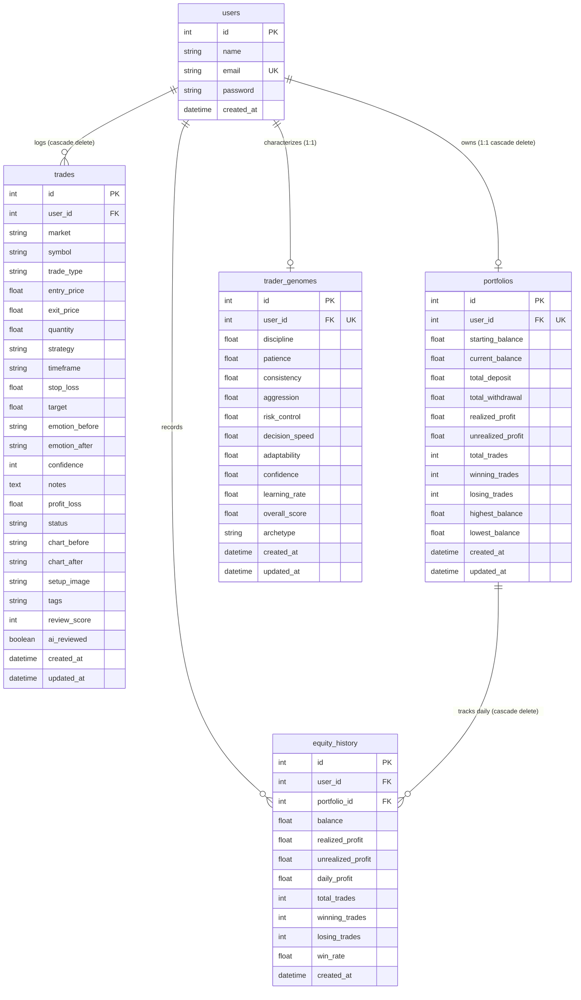

# Tradenza Database Specification

## 1. Overview

Tradenza uses **SQLite** (via **Flask-SQLAlchemy** / **SQLAlchemy 2.0**) as its relational datastore. The schema is normalized and models user identity, trade execution history, financial equity tracking, and trader psychological profiling.

---

## 2. Table Schemas

### `users`
Stores user authentication credentials and account metadata.

| Column | Type | Constraints | Description |
|---|---|---|---|
| `id` | `INTEGER` | `PRIMARY KEY`, Auto-increment | Unique identifier for the user |
| `name` | `VARCHAR(100)` | `NOT NULL` | User full name |
| `email` | `VARCHAR(120)` | `NOT NULL`, `UNIQUE` | User email address (login credential) |
| `password` | `VARCHAR(255)` | `NOT NULL` | Werkzeug salted hash of password |
| `created_at` | `DATETIME` | Server default `NOW()` | Registration timestamp |

**Relationships:**
- `trades`: One-to-Many (`Trade`), cascade delete-orphan.
- `portfolio`: One-to-One (`Portfolio`), cascade delete-orphan.

---

### `trades`
Stores granular trade records entered by the user or imported via CSV.

| Column | Type | Constraints | Description |
|---|---|---|---|
| `id` | `INTEGER` | `PRIMARY KEY`, Auto-increment | Unique identifier for the trade |
| `user_id` | `INTEGER` | `FOREIGN KEY(users.id)`, `NOT NULL` | Owning trader ID |
| `market` | `VARCHAR(30)` | `NOT NULL` | Market classification (e.g., FOREX, CRYPTO, STOCKS, INDICES) |
| `symbol` | `VARCHAR(30)` | `NOT NULL` | Instrument symbol (e.g., EURUSD, BTCUSDT, AAPL, NIFTY) |
| `trade_type` | `VARCHAR(10)` | `NOT NULL` | Side: `BUY` (Long) or `SELL` (Short) |
| `entry_price` | `FLOAT` | `NOT NULL` | Execution entry price |
| `exit_price` | `FLOAT` | `NULLABLE` | Execution exit price (`NULL` if trade is open) |
| `quantity` | `FLOAT` | `NOT NULL` | Position size / lots / shares |
| `strategy` | `VARCHAR(100)` | `NULLABLE` | Strategy applied (e.g., Breakout, Mean Reversion, Trend Following) |
| `timeframe` | `VARCHAR(30)` | `NULLABLE` | Trading timeframe (e.g., 5M, 15M, 1H, 4H, 1D) |
| `stop_loss` | `FLOAT` | `NULLABLE` | Planned invalidation price |
| `target` | `FLOAT` | `NULLABLE` | Planned profit take price |
| `emotion_before`| `VARCHAR(50)` | `NULLABLE` | Emotional state prior to entry (e.g., Confident, Calm, Anxious, FOMO) |
| `emotion_after` | `VARCHAR(50)` | `NULLABLE` | Emotional state upon exit |
| `confidence` | `INTEGER` | `NULLABLE` | Conviction score (1 - 10) |
| `notes` | `TEXT` | `NULLABLE` | Qualitative trade journal commentary |
| `profit_loss` | `FLOAT` | `NULLABLE` | Realized P&L in currency units |
| `status` | `VARCHAR(20)` | Default `"OPEN"` | Status (`OPEN` or `CLOSED`) |
| `chart_before` | `VARCHAR(255)` | `NULLABLE` | File path to pre-trade chart image |
| `chart_after` | `VARCHAR(255)` | `NULLABLE` | File path to post-trade chart image |
| `setup_image` | `VARCHAR(255)` | `NULLABLE` | Additional setup screenshot path |
| `tags` | `VARCHAR(255)` | `NULLABLE` | Comma-delimited category tags |
| `review_score` | `INTEGER` | `NULLABLE` | Calculated review score (0 - 100) |
| `ai_reviewed` | `BOOLEAN` | Default `FALSE` | Indicates whether processed by AI review |
| `created_at` | `DATETIME` | Default `utcnow()` | Timestamp when trade entry logged |
| `updated_at` | `DATETIME` | Default `utcnow()`, onupdate | Timestamp of last modification |

---

### `portfolios`
Maintains account balance, cumulative P&L, and aggregated performance statistics.

| Column | Type | Constraints | Description |
|---|---|---|---|
| `id` | `INTEGER` | `PRIMARY KEY`, Auto-increment | Unique identifier |
| `user_id` | `INTEGER` | `FOREIGN KEY(users.id)`, `UNIQUE`, `NOT NULL` | Associated user ID |
| `starting_balance`| `FLOAT` | Default `0.0` | Initial capital deposit |
| `current_balance` | `FLOAT` | Default `0.0` | Dynamic current balance |
| `total_deposit` | `FLOAT` | Default `0.0` | Cumulative lifetime deposits |
| `total_withdrawal`| `FLOAT` | Default `0.0` | Cumulative lifetime withdrawals |
| `realized_profit`| `FLOAT` | Default `0.0` | Sum of closed trade P&L |
| `unrealized_profit`| `FLOAT`| Default `0.0` | Open trade unrealized profit |
| `total_trades` | `INTEGER` | Default `0` | Total trade count |
| `winning_trades` | `INTEGER` | Default `0` | Number of winning trades (P&L > 0) |
| `losing_trades` | `INTEGER` | Default `0` | Number of losing trades (P&L < 0) |
| `highest_balance`| `FLOAT` | Default `0.0` | Peak account equity (high-water mark) |
| `lowest_balance` | `FLOAT` | Default `0.0` | Lowest account equity (max drawdown mark) |
| `created_at` | `DATETIME` | Default `utcnow()` | Creation timestamp |
| `updated_at` | `DATETIME` | Default `utcnow()`, onupdate | Last update timestamp |

**Virtual Properties:**
- `net_profit`: `current_balance - starting_balance`
- `growth_percentage`: `((current_balance - starting_balance) / starting_balance) * 100`
- `win_rate`: `(winning_trades / total_trades) * 100`

---

### `equity_history`
Captures daily snapshots of portfolio metrics to generate equity curve and profit charts.

| Column | Type | Constraints | Description |
|---|---|---|---|
| `id` | `INTEGER` | `PRIMARY KEY`, Auto-increment | Snapshot record ID |
| `user_id` | `INTEGER` | `FOREIGN KEY(users.id)`, `NOT NULL` | Owning trader ID |
| `portfolio_id` | `INTEGER` | `FOREIGN KEY(portfolios.id)`, `NOT NULL`| Associated portfolio ID |
| `balance` | `FLOAT` | `NOT NULL`, Default `0.0` | Account balance at snapshot |
| `realized_profit`| `FLOAT`| Default `0.0` | Cumulative realized profit |
| `unrealized_profit`| `FLOAT`| Default `0.0` | Current open unrealized profit |
| `daily_profit` | `FLOAT` | Default `0.0` | Profit attributed to the snapshot date |
| `total_trades` | `INTEGER` | Default `0` | Trade count at snapshot time |
| `winning_trades` | `INTEGER` | Default `0` | Win count at snapshot time |
| `losing_trades` | `INTEGER` | Default `0` | Loss count at snapshot time |
| `win_rate` | `FLOAT` | Default `0.0` | Win rate percentage at snapshot time |
| `created_at` | `DATETIME` | Default `utcnow()` | Timestamp of snapshot creation |

---

### `trader_genomes`
Stores the calculated 9-dimensional behavioral scores and psychological archetype.

| Column | Type | Constraints | Description |
|---|---|---|---|
| `id` | `INTEGER` | `PRIMARY KEY`, Auto-increment | Record ID |
| `user_id` | `INTEGER` | `FOREIGN KEY(users.id)`, `UNIQUE`, `NOT NULL` | Associated trader ID |
| `discipline` | `FLOAT` | Default `0.0` | Discipline Score (0 - 100) |
| `patience` | `FLOAT` | Default `0.0` | Patience Score (0 - 100) |
| `consistency` | `FLOAT` | Default `0.0` | Sizing & execution consistency (0 - 100) |
| `aggression` | `FLOAT` | Default `0.0` | Risk-taking / frequency index (0 - 100) |
| `risk_control` | `FLOAT` | Default `0.0` | Risk management adherence (0 - 100) |
| `decision_speed`| `FLOAT` | Default `0.0` | Execution latency / hold speed (0 - 100) |
| `adaptability` | `FLOAT` | Default `0.0` | Strategy agility (0 - 100) |
| `confidence` | `FLOAT` | Default `0.0` | Self-reported vs actual edge (0 - 100) |
| `learning_rate` | `FLOAT` | Default `0.0` | Rate of pattern mitigation (0 - 100) |
| `overall_score` | `FLOAT` | Default `0.0` | Composite weighted genome index (0 - 100) |
| `archetype` | `VARCHAR(100)`| Default `"Unknown Trader"` | Classified trader archetype |
| `created_at` | `DATETIME` | Default `utcnow()` | Profile creation date |
| `updated_at` | `DATETIME` | Default `utcnow()`, onupdate | Profile recalculation date |
